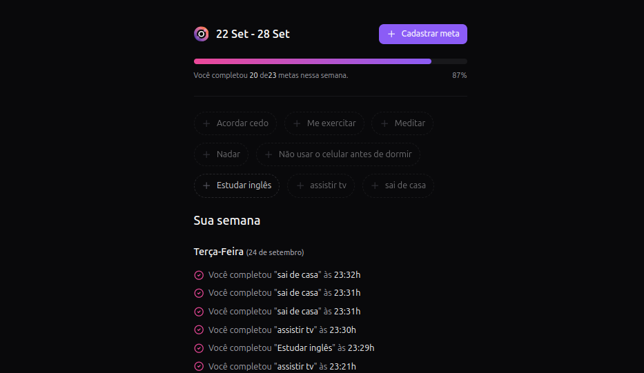

# in.orbit


## Sobre a aplicação
### A in.orbit é um app para ajudar você a definir e cumprir suas metas pessoais. Nele, você pode criar suas metas e, ao completá-las, o aplicativo registra a data e hora em que foram concluídas. Depois, você pode ver essas informações organizadas por dia da semana. É uma forma prática de acompanhar seu progresso!

### Para rodar este projeto, além de clonar este projeto, é preciso estar com o backend funcionando.
#### para acessar o repositório do backend, clique aqui: [in.orbit backend](https://github.com/CarlosHenriqueG/in.orbit-backend?tab=readme-ov-file#readme) 

## Tecnologias 💻

- [VITE](https://vitejs.dev/)
- [REACT](https://react.dev/)
- [TYPESCRIPT](https://www.typescriptlang.org/)
- [TAILWIND](https://tailwindcss.com/)
- [POSTCSS](https://tailwindcss.com/)
- [BIOMEJS](https://biomejs.dev/)

### Clone o projeto
```bash
  git clone https://github.com/CarlosHenriqueG/in-orbit-frontend.git
```
### Entre no diretório do projeto
```bash
  cd in-orbit-frontend
```
### Instale as dependências
```bash
  pnpm install
```
### Inicie o frontend
```bash
  pnpm run dev
```

# Contribuição
Sinta-se à vontade para contribuir! Abra uma issue ou envie um pull request.

# Licença
[](https://choosealicense.com/licenses/mit/)